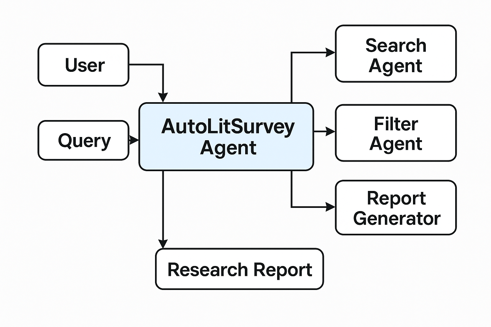

# 📘 AutoLitSurvey – Offline Multi-Agent Literature Review System

A fully offline, no-API, multi-agent system that automates literature surveys using semantic retrieval, extractive summarization, keyword extraction, and topic mining.

---

## 🧠 Architecture Diagram




---

## 🚀 Overview

AutoLitSurvey automates the entire literature review workflow:

- Retrieves relevant papers  
- Ranks using semantic similarity (MiniLM embeddings)  
- Extractively summarizes each paper  
- Extracts keywords using TF-IDF  
- Identifies topics  
- Produces structured reports in **Markdown + HTML**  
- Creates a complete agent trace (`trace.json`)  

**100% Offline — No APIs. No LLMs. No internet required.**

---

## ✨ Features

### 🔹 Multi-Agent Pipeline  
- **Search Agent** – retrieves papers  
- **Filter Agent** – semantic ranking  
- **Summarizer Agent** – extractive summaries  
- **Keyword Agent** – TF-IDF keywords  
- **Topic Agent** – topic detection  
- **Report Agent** – generates final survey  
- **Trace Agent** – logs steps  

### 🔹 Offline & Lightweight  
- Only needs MiniLM (~90MB)  
- Works in Colab, Kaggle, local  


---

# ✅ **Correct GitHub Folder Structure**

```markdown
AutoLitSurvey/
│
├── src/
│   ├── agent.py
│   └── tools/
│       ├── retriever.py
│       ├── vectorstore.py
│       ├── summarizer_extractive.py
│       ├── keywords.py
│       ├── clustering.py
│       ├── tablegen.py
│       ├── report_writer.py
│
├── notebook/
│   └── AutoLitSurvey.ipynb
│
├── data/
│   └── abstracts.csv
│
├── outputs/
│   ├── diagram.png
│   ├── report.md
│   ├── report.html
│   └── trace.json
│
├── requirements.txt
└── README.md
```
## 📓 Notebook

You can run the full AutoLitSurvey pipeline here:

➡️ **notebook/AutoLitSurvey.ipynb**

## Push everything to GitHub
```markdown
!git init
!git add .
!git commit -m "Initial AutoLitSurvey commit"
!git branch -M main
!git remote add origin https://github.com/<your-username>/AutoLitSurvey.git
!git push -u origin main
```
